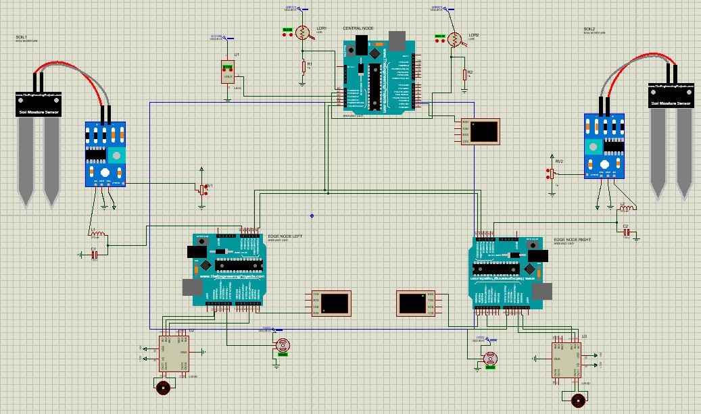
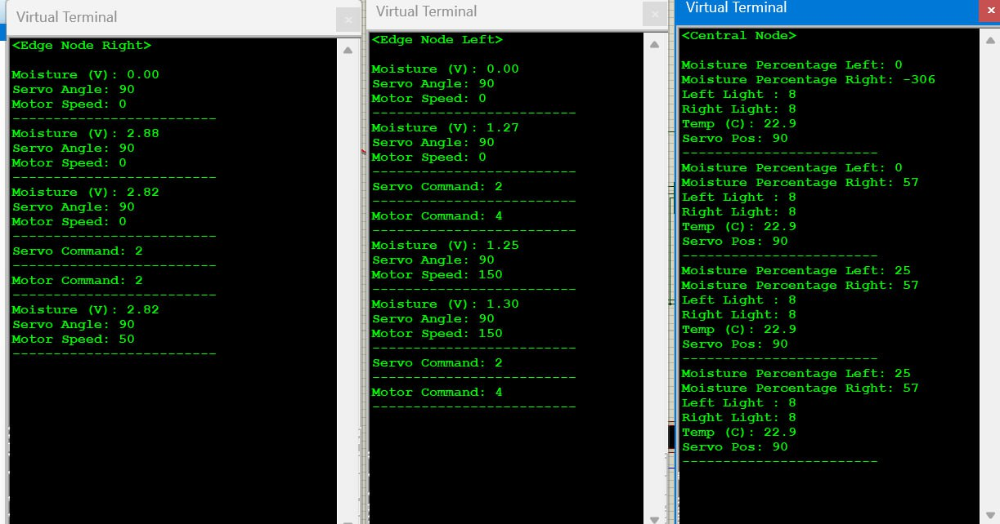
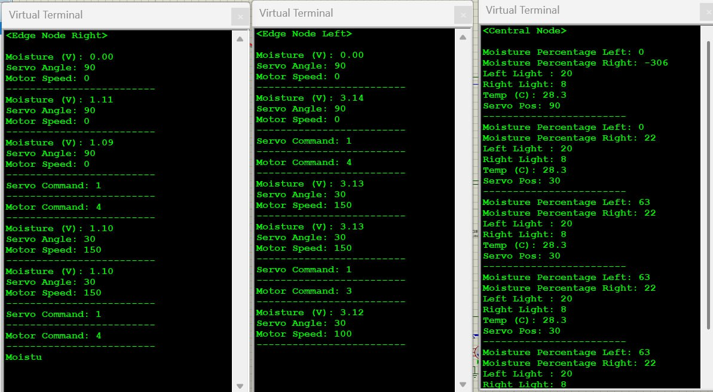

# Smart Plant Monitoring and Control System

## Project Overview
This project implements a distributed IoT system for monitoring and controlling plant conditions using multiple Arduino nodes. The system consists of a central control node and two edge nodes that work together to maintain optimal conditions for plant growth.

## System Architecture
The system is composed of three main components:

1. **Central Node**: Acts as the brain of the system, collecting data from edge nodes and making control decisions
2. **Edge Node Left**: Monitors and controls the left plant's conditions
3. **Edge Node Right**: Monitors and controls the right plant's conditions

### Hardware Components
- 3x Arduino boards
- Light sensors
- Moisture sensors
- Temperature sensors
- Servo motors
- DC motors
- I2C communication modules
- Virtual terminals for visualization

## System Schematic

*Figure 1: Complete system schematic showing the three Arduino nodes connected via I2C, with moisture sensors, light sensors, servos, and motor drivers*

## Code Structure

### Central Node (`CentralNode.ino`)
The central node is responsible for:
- Reading light sensor values from both sides
- Monitoring temperature
- Receiving moisture data from edge nodes
- Making control decisions based on sensor readings
- Sending commands to edge nodes via I2C

Key features:
- Light intensity comparison between left and right sides
- Temperature monitoring
- Moisture level monitoring
- Adaptive control logic for plant positioning
- Comprehensive status logging

#### Key Code Sections:

```cpp
void sendCommands(int addr, int moisturePercentage) {
  Wire.beginTransmission(addr);
  if (lightSensorsDiff > thresholdForLightSensors) {
    flowerPotPosition = 30;
    Wire.write(1);
  } else if (lightSensorsDiff < -thresholdForLightSensors) {
    flowerPotPosition = 150;
    Wire.write(3);
  } else {
    flowerPotPosition = 90;
    Wire.write(2);
  }
  // Adaptive watering control based on moisture and temperature
  if (moisturePercentage < 50) {
    Wire.write(4); // Set Speed to 150
  } else if (80 < moisturePercentage) {
    Wire.write(1); // Set Speed to 0
  } else {
    if (temperatureCelsius > 25) {
      Wire.write(3); // Set Speed to 100
    } else {
      Wire.write(2); // Set Speed to 50
    }
  }
  Wire.endTransmission();
}
```
This core function demonstrates how the central node makes decisions:
- Analyzes light sensor differences to position plants
- Implements adaptive watering based on moisture levels
- Adjusts watering intensity based on temperature

### Edge Nodes (`EdgeNodeLeft.ino` and `EdgeNodeRight.ino`)
The edge nodes are responsible for:
- Reading moisture sensor values
- Controlling servo motors for plant positioning
- Controlling water pump speed
- Communicating with the central node via I2C

Key features:
- Moisture level monitoring
- Servo motor control
- Water pump speed control
- I2C communication handling
- Status logging

#### Key Code Sections:

```cpp
void receiveEvent() {
  while (Wire.available()) {
    int c = Wire.read();
    if (commandCNT % 2 == 0) {
      servoPosition = 1167 + ((c - 1) * 333);
      Serial.print("Servo Command: ");
      Serial.println(c);
    } else {
      motorSpeed = (c - 1) * 50;
      Serial.print("Motor Command: ");
      Serial.println(c);
    }
    commandCNT++;
  }
}
```
This event handler shows how edge nodes:
- Process commands from the central node
- Calculate precise servo positions (30°, 90°, 150°)
- Set appropriate motor speeds (0, 50, 100, 150)

```cpp
void readMoistureSensor() {
  moistureSensorValue = analogRead(A0);
  sensorVoltage = moistureSensorValue * VOLTAGE_CONVERSION;
  dataToSend = converter(sensorVoltage);
}

int converter(float input) {
  int value = input * 100;
  int mappedValue = map(value, 0, 500, 128, 255);
  if (mappedValue <= 129) return 128;
  if (mappedValue >= 254) return 254;
  return (mappedValue % 2 == 0) ? mappedValue : mappedValue + 1;
}
```
This code shows the moisture sensing implementation:
- Reads analog moisture values
- Converts to meaningful voltage readings
- Maps values to a standardized range for consistency
- Ensures even numbers for stable communication

## Control Logic

### Plant Positioning
The system uses light sensors to determine the optimal position for each plant:
- If left side is brighter: Move plant to 30° position
- If right side is brighter: Move plant to 150° position
- If light is balanced: Keep plant at 90° position

### Watering Control
Watering is controlled based on:
- Moisture levels (percentage)
- Temperature conditions
- Different speed settings:
  - 0% speed when moisture > 80%
  - 50% speed when moisture < 50% and temperature ≤ 25°C
  - 100% speed when moisture < 50% and temperature > 25°C

## System Configuration

### Configuration 1: Balanced Light, High Temperature State

*Figure 2: System state showing:*
- Central Node readings:
  - Left Light: 20, Right Light: 8 (unbalanced lighting)
  - Temperature: 28.3°C (high temperature)
  - Servo Position: 30° (adjusted for light imbalance)
- Edge Node Left:
  - Moisture: 3.13V with 63% moisture percentage
  - Motor Speed: 150 (high watering due to temperature)
- Edge Node Right:
  - Moisture: 1.10V with 22% moisture percentage
  - Motor Speed: 150 (high watering due to low moisture)

### Configuration 2: Balanced State with Normal Temperature

*Figure 3: System in balanced operation showing:*
- Central Node readings:
  - Left Light: 8, Right Light: 8 (balanced lighting)
  - Temperature: 22.9°C (normal temperature)
  - Servo Position: 90° (centered due to balanced light)
- Edge Node Left:
  - Moisture: 1.25-1.30V with 25% moisture percentage
  - Motor Speed: 150 (high watering due to low moisture)
- Edge Node Right:
  - Moisture: 2.82V with 57% moisture percentage
  - Motor Speed: 50 (moderate watering due to adequate moisture)

### Key Observations from Configurations
- The system actively responds to light imbalances by adjusting servo positions
- Water pump speeds are dynamically adjusted based on:
  - Moisture levels (0-100%)
  - Temperature conditions (above/below 25°C threshold)
  - Combined moisture-temperature decision logic
- I2C communication enables coordinated response between nodes
- The central node successfully aggregates sensor data and issues appropriate commands to edge nodes

## Terminal Output
The terminal outputs demonstrate the system's real-time monitoring capabilities:
- Moisture readings in both voltage and percentage
- Light sensor values showing ambient light distribution
- Temperature monitoring with precision to 0.1°C
- Servo positions reflecting light-balancing decisions
- Motor speeds showing adaptive watering control

## Implementation Details

### Communication Protocol
The system uses I2C with:
- Central Node as master
- Edge Nodes as slaves (addresses 8 and 9)
- Two-byte command structure:
  - First byte: Servo position (1=30°, 2=90°, 3=150°)
  - Second byte: Motor speed (1=0, 2=50, 3=100, 4=150)

### Control Logic Implementation
The system implements a hierarchical control structure:
1. Light Balance Control:
   - Threshold-based decision making
   - Three-position servo adjustment (30°, 90°, 150°)
2. Moisture Control:
   - Primary threshold at 50% (triggers high-speed watering)
   - Upper threshold at 80% (stops watering)
   - Intermediate range with temperature influence
3. Temperature Influence:
   - 25°C threshold for increased watering
   - Affects watering speed in moderate moisture conditions

## Summary

This project demonstrates a sophisticated IoT-based plant care system that successfully implements:

### System Architecture Achievements
- **Distributed Control**: Implementation of a master-slave architecture with one central node and two edge nodes
- **Reliable Communication**: Robust I2C protocol implementation for inter-node data exchange
- **Real-time Monitoring**: Continuous tracking of environmental conditions through multiple sensors

### Intelligent Control Features
- **Adaptive Plant Positioning**
  - Dynamic adjustment of plant positions based on light conditions
  - Three-position servo control (30°, 90°, 150°) for optimal light exposure
  - Quick response to light imbalances

- **Smart Watering System**
  - Moisture-based watering control with percentage-based thresholds
  - Temperature compensation in watering decisions
  - Four-speed pump control (0, 50, 100, 150) for precise water delivery

- **Environmental Monitoring**
  - Accurate temperature sensing with 0.1°C precision
  - Reliable moisture sensing with voltage-to-percentage conversion
  - Continuous light intensity monitoring

### System Performance
The implemented system successfully demonstrates:
- Autonomous operation without human intervention
- Quick adaptation to environmental changes
- Precise control over plant positioning and watering
- Reliable sensor data collection and processing
- Efficient communication between nodes

### Future Potential
The modular design allows for easy expansion with possibilities such as:
- Adding more edge nodes for larger plant systems
- Implementing wireless communication capabilities
- Integrating with cloud platforms for remote monitoring
- Adding machine learning for predictive maintenance
- Incorporating additional environmental sensors

This project serves as a practical example of how IoT technologies can be applied to create intelligent, autonomous systems for plant care and monitoring, with real-world applications in both domestic and commercial settings.
